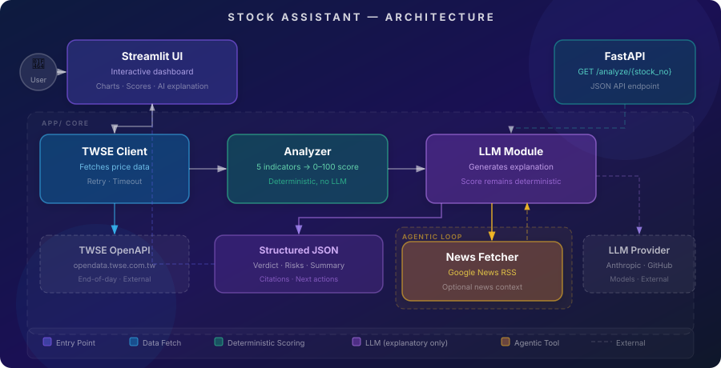

[English](README.md) | [繁體中文](README.zh-TW.md)

# Stock Assistant

A quantitative screening tool for Taiwan listed stocks. The system fetches 60 trading days of TWSE data, scores five technical indicators (0–100), then runs an **agentic news search** — the LLM actively decides what to search and calls a `search_news` tool to fetch relevant headlines from Google News RSS before generating a structured analysis.

## Demo

<!-- Replace with actual demo video / GIF after recording -->
> 🎬 *Demo video — coming soon*

## Features

| Feature | Description |
|---------|-------------|
| Single-stock analysis | Technical scoring + agentic news search + AI explanation in retail / institutional modes |
| Multi-stock comparison | Up to 4 stocks, normalized % return overlay chart + side-by-side indicator score table |
| AI search transparency | Expandable panel showing each LLM thinking step and news search with per-step timing |
| Dual LLM provider | Supports Anthropic (Claude) and GitHub Models (gpt-4o-mini) via `LLM_PROVIDER` env var |

## Architecture



**Architecture Highlights:**
- Two entry points — Streamlit dashboard for interactive use and FastAPI for programmatic access — both import `app/` directly with no HTTP layer between them.
- Stock price data is fetched from TWSE OpenAPI; news context is retrieved on a best-effort basis from Google News RSS via an agentic tool-use loop.
- The scoring logic (`analyzer.py`) is fully deterministic and does not depend on the LLM — charts and scores remain functional even if the LLM call fails.
- The LLM is used only for explanation, summarization, and risk interpretation; it calls `search_news` as a tool to decide what news to fetch rather than receiving pre-formatted headlines.
- The final output is typed JSON rendered into two UI modes: retail (narrative) and institutional (raw scores + signals).

## Design Decisions

- **Direct Import** — Streamlit imports `app/` modules directly, no FastAPI middleman. Avoids an unnecessary network hop for a single-user demo; both entry points share the same core without coupling to each other.
- **Deterministic Scoring** — All indicator calculation and verdict logic lives in `analyzer.py` (pure Python/pandas). The LLM never touches the score. If the LLM fails entirely, charts and scores remain fully functional.
- **LLM is Explanatory Only** — The LLM receives a structured summary (scores + searched news), not raw price data. The system prompt explicitly prohibits adding external knowledge, scoping hallucination risk to the explanation layer only.
- **Agentic News Search** — Instead of pre-fetching fixed headlines and passing them to the LLM, the LLM decides what to search. It calls `search_news` as a tool (max 3 rounds), picks its own queries, and incorporates results into the analysis. This mirrors how an analyst would look up context on demand.

## LLM Strategy

Claude (or gpt-4o-mini) runs an agentic tool-use loop and returns a typed JSON object:

```json
{
  "verdict": "值得關注",
  "confidence": "高",
  "key_signals": ["成交量放大 1.8 倍", "短期均線上穿長期均線"],
  "risks": ["RSI 偏高，注意追高風險"],
  "summary": "...",
  "next_actions": ["觀察成交量是否持續放大"]
}
```

**Agentic loop:**
```
LLM receives: indicator scores + verdict + date range
    → LLM decides query ("台積電 法說會")
    → tool call: search_news_by_query(query)
    → News Fetcher: Google News RSS
    → results injected back into conversation
    → LLM may search again (max 3 rounds)
    → LLM generates final JSON
    → _linkify_news_citations(): 《title》→ [title](url)
```

**Provider support:**
- `LLM_PROVIDER=anthropic` — Claude via `anthropic` SDK, native `tool_use` / `end_turn` protocol
- `LLM_PROVIDER=github` — gpt-4o-mini via OpenAI-compatible SDK, `function_calling` / `finish_reason` protocol

**UI transparency:**
- Expandable "AI search process" panel shows every step with timing
- 💭 LLM thinking steps (e.g., "AI 思考中 4.0s")
- 🔍 Search steps (e.g., "搜尋：台積電 法說會 → 5 則 0.9s")
- All step durations sum to the displayed total elapsed time

**Fallback behavior:**
- If the agentic loop exhausts max rounds or JSON parsing fails, a low-confidence fallback `LLMOutput` is returned — charts and scores are unaffected

## TWSE API Integration

`STOCK_DAY` endpoint — 3 calls per stock (one per month, ~60 trading days total).

**Three distinct error types:**

| Error | Cause | Handling |
|-------|-------|----------|
| `StockNotFoundError` | Ticker absent from TWSE listed stocks | User-facing error, early return |
| `InsufficientDataError` | Fewer than 20 trading days returned | User-facing warning, early return |
| `TWSEUnavailableError` | API unreachable after 3 retries (exponential backoff) | User-facing error, early return |

**Rate limiting:** Multi-stock comparison fetches sequentially with 0.5 s delay between tickers, plus `st.cache_data(ttl=600)` to avoid redundant requests. (Concurrent fetching with `asyncio.gather` triggered HiNetCDN WAF — HTTP 307 with no `Location` header — diagnosed via `curl`; fixed by switching to sequential fetch.)

## Scoring Logic

Score ≥ 60 → "Worth Watching". All thresholds are manually calibrated domain knowledge; not backtested.

| Indicator | Weight | Type | Logic |
|-----------|--------|------|-------|
| MA Crossover | 25 | Leading | 5-day MA > 20-day MA → 25 pts |
| Volume Surge | 25 | Leading | 5-day avg vol / 20-day avg vol ≥ 1.5 → 25 pts; ≥ 1.2 → 15 pts |
| Price Trend | 20 | Coincident | 30-day return > 5% → 20 pts; > 0% → 10 pts |
| RSI (14-day) | 20 | Coincident | RSI 45–65 → 20 pts; 35–45 or 65–75 → 10 pts |
| Stability | 10 | Risk | Price CV < 0.05 → 10 pts |

Leading indicators (MA + Volume) carry higher weight because the goal is early detection, not confirmation of events already past.

## Setup

**Prerequisites:** Python 3.9+, one of: Anthropic API key or GitHub Models token

```bash
cd stock-assistant
pip install -r requirements.txt
cp .env.example .env
```

**.env options:**
```bash
# Option A: Anthropic (Claude)
LLM_PROVIDER=anthropic
ANTHROPIC_API_KEY=sk-ant-...

# Option B: GitHub Models (gpt-4o-mini, free tier available)
LLM_PROVIDER=github
GITHUB_TOKEN=ghp_...
```

**Run locally**
```bash
streamlit run 台股分析.py      # UI → http://localhost:8501
uvicorn app.main:app --reload  # REST API → http://localhost:8000/docs
```

**Run with Docker**
```bash
docker compose up
```

## Testing

```bash
pytest tests/
```

46 unit tests across three modules:
- `test_analyzer.py` — indicator calculation and scoring edge cases
- `test_twse_client.py` — data parsing mocks (comma stripping, ROC-to-AD date conversion)
- `test_llm.py` — agentic loop logic (tool call routing, duplicate query deduplication, max-rounds fallback, provider switching)

## Assumptions, Limitations & Risks

| Item | Detail |
|------|--------|
| Data scope | TWSE listed stocks only — no OTC, ETFs, or warrants |
| Data freshness | End-of-day only; current trading day unavailable until ~14:00 after market close |
| News reliability | Google News RSS is best-effort; failures silently degrade to no-news mode |
| LLM accuracy | Hallucination risk exists; mitigated by structured prompt scope and user-visible clickable news source links |
| TWSE stability | HiNetCDN WAF may temporarily block IPs under high request frequency |
| Scoring thresholds | Manually calibrated — not validated against historical returns |
