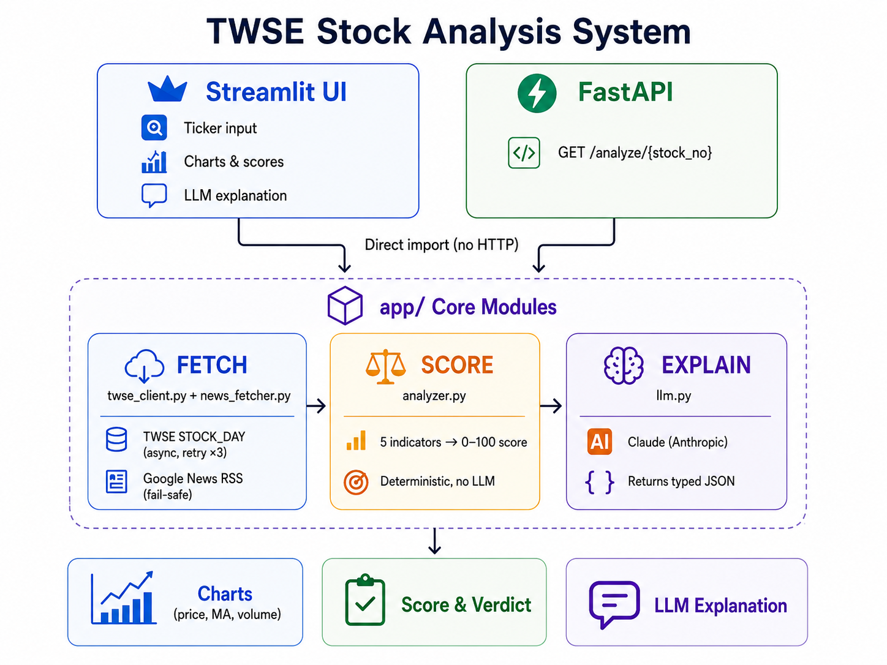

[English](README.md) | [繁體中文](README.zh-TW.md)

# 台股關注度分析 Assistant

輸入股票代號，系統從 TWSE OpenAPI 抓取近 60 筆交易日資料，計算五項技術指標並產生量化評分（0–100），再透過 Google News RSS 抓取近期新聞標題增強 LLM 上下文，最後由 Claude 生成結構化分析說明。

## Demo

<!-- 錄製完成後，將 Demo 影片或 GIF 放在這裡 -->
> 🎬 *Demo 影片 — 即將上線*

## 功能

| 功能 | 說明 |
|------|------|
| 單股分析 | 技術指標評分 + RAG 新聞增強 + Claude AI 說明（散戶 / 法人兩種模式） |
| 多股比較 | 最多 4 支股票，標準化相對漲跌幅（%）疊圖 + 技術指標評分比較表 |

## 系統架構



## 設計決策

- **直接 Import** — Streamlit 直接 import `app/` 模組，不走 FastAPI HTTP。省去不必要的網路開銷；兩個 entry point 共用同一份核心，互不耦合。
- **確定性評分** — 所有指標計算與結論邏輯都在 `analyzer.py`（純 Python/pandas）。LLM 不碰評分。就算 Claude 完全失敗，圖表和分數仍正常顯示。
- **LLM 只負責解釋** — Claude 收到的是結構化摘要（評分 + 新聞標題），不是原始股價資料。System prompt 明確禁止引用外部資訊，把幻覺風險框限在說明文字層。
- **非阻塞 RAG** — Google News RSS 新聞抓取為 best-effort 路徑。任何失敗都靜默 catch 並回傳空 list，不阻斷評分或 LLM 說明的主流程。

## LLM 使用方式與 Prompt 策略

Claude 收到的是結構化指標摘要（評分 + 新聞標題），不是原始股價資料，回傳定型的 JSON：

```json
{
  "verdict": "值得關注",
  "confidence": "高",
  "key_signals": ["成交量放大 1.8 倍", "短期均線上穿長期均線"],
  "risks": ["RSI 偏高，注意追高風險"],
  "summary": "..."
}
```

**Prompt 設計：**
- System prompt 固定並加上 `cache_control`（Anthropic Prompt Caching — 5 分鐘 TTL 內相同 prompt 不重複計費）
- 明確指示 LLM「只能根據給定的量化指標和提供的新聞標題進行說明，不能加入外部資訊」
- 透過 `messages.stream()` 串流輸出，讓 UI 即時顯示進度
- 同一份 JSON 渲染兩種檢視：**散戶模式**（敘事摘要）與**法人模式**（數字明細 + 訊號列表）
- JSON 解析失敗時，顯示原始串流文字作為 fallback；量化評分不受影響

**RAG 流程：**
```
Google News RSS（股票代號 + 名稱關鍵字）
    → fetch_recent_news()         ← 任何例外 → 回傳空 list
    → 新聞標題附加至 prompt
    → LLM 在 summary 中引用標題
    → UI 顯示「參考新聞來源」expander 供使用者驗證
```

## TWSE API 串接與例外處理

使用 `STOCK_DAY` endpoint — 每支股票打 3 次（每月一次，共約 60 個交易日）。

**三種明確的例外情境：**

| 例外 | 原因 | 處理方式 |
|------|------|----------|
| `StockNotFoundError` | 股票代號不在 TWSE 上市名單 | 顯示錯誤訊息，early return |
| `InsufficientDataError` | 回傳交易日數 < 20 | 顯示警告訊息，early return |
| `TWSEUnavailableError` | 指數退避 retry 3 次後仍失敗 | 顯示錯誤訊息，early return |

**限流處理：** 多股比較改用 sequential fetch，每支股票間隔 0.5 秒，搭配 `st.cache_data(ttl=600)` 避免重複請求。（原本用 `asyncio.gather` 並發，觸發 HiNetCDN WAF 回傳 HTTP 307 無 `Location` header — 透過 `curl` 診斷確認後改成同步依序抓取。）

## 評分邏輯

總分 ≥ 60 → 判定「值得關注」。所有門檻值為人工設定，未做回測驗證。

| 指標 | 權重 | 分類 | 判斷邏輯 |
|------|------|------|----------|
| MA 黃金交叉 | 25 | 領先指標 | 5日MA > 20日MA → 25分 |
| 成交量放大 | 25 | 領先指標 | 近5日均量/近20日均量 ≥1.5 → 25分；≥1.2 → 15分 |
| 價格趨勢 | 20 | 同步指標 | 近30日漲幅 >5% → 20分；>0% → 10分 |
| RSI（14日）| 20 | 同步指標 | RSI 45–65 → 20分；35–45 或 65–75 → 10分 |
| 價格穩定性 | 10 | 風險指標 | 變異係數 < 0.05 → 10分 |

領先指標（MA + 量能）權重較高，目標是「提早發現」而非「確認已發生的事」。

## 安裝與啟動

**前置條件：** Python 3.9+，Anthropic API Key

```bash
cd stock-assistant
pip install -r requirements.txt
cp .env.example .env   # 填入 ANTHROPIC_API_KEY
```

**本機啟動**
```bash
streamlit run 台股分析.py      # UI → http://localhost:8501
uvicorn app.main:app --reload  # REST API → http://localhost:8000/docs
```

**Docker 啟動**
```bash
docker compose up
```

## 測試

```bash
pytest tests/
```

29 個單元測試，涵蓋兩個模組：
- `test_analyzer.py` — 各指標計算與評分邊界條件
- `test_twse_client.py` — 資料解析 mock（千分位處理、民國年轉換）

`llm.py` 不測試（非確定性輸出）。

## 重要假設、限制與風險

| 項目 | 說明 |
|------|------|
| 資料範圍 | 僅限 TWSE 上市股票，不含上櫃、ETF、權證 |
| 資料即時性 | 僅提供盤後完整資料；當日資料約於收盤後 14:00 起才能取得 |
| 新聞可靠性 | Google News RSS 為 best-effort，失敗時靜默降級為無新聞模式 |
| LLM 準確性 | LLM 有幻覺風險；透過結構化 prompt 範圍限制 + UI 顯示新聞來源供使用者自行驗證來降低影響 |
| TWSE 穩定性 | HiNetCDN WAF 在高頻請求下可能暫時封鎖 IP |
| 評分門檻 | 人工設定，未經回測驗證 |
